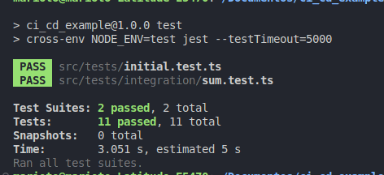

# CI/CD Demonstration Application

This repository contains a simple application designed to demonstrate the functionality of **CI/CD** (Continuous Integration and Continuous Delivery) pipelines using **GitHub Actions**.

---

## 📋 Features

- Basic CI/CD pipeline configuration.
- Automated testing, lint and build on every _pull request_.
- Automated preview deployment to every branch push except main branch with vercel.
- Automated production deployment to every main branch push with vercel.

---

## 🚀 Primary technologies used

- **Node.js**: Primary language for the application.
- **Typescript**: Adds additional syntax to JavaScript.
- **ExpressJs**: API Restful framework.
- **Jest**: Testing framework (for code validation).
- **GitHub Actions**: Tool for managing the CI/CD pipeline.

---

## 📁 Project s tructure

```plaintext
├── .github/                      # Directory for GitHub-specific configurations
│   └── workflows/                # Contains CI/CD workflows for GitHub Actions
│       └── lint-tests-build.yml  # Workflow for linting, running tests, and building the application
│       └── preview.yml           # Workflow for deploying the application to a preview environment (e.g., Vercel)
│       └── deploy.yml            # Workflow for deploying the application to a production environment (e.g., Vercel)
├── src/                          # Main source code of the application
│   └── math/                     # Contains math-related logic
│       └── math.controller.ts    # Handles requests and responses related to math operations
│       └── math.service.ts       # Contains the core business logic for math operations
│   └── shared/                   # Contains reusable shared code across the application
│       └── interfaces/           # TypeScript interfaces for defining contracts and structures
│       └── middlewares/          # Middleware functions for request/response processing
│       └── validator/            # Contains validation logic for incoming data
│   ├── tests/                    # Contains unit and integration tests for the application
│   ├── app.js                    # Main application entry point, sets up routes and middleware
│   └── server.js                 # Starts the server and listens on a specified port
├── .gitignore                    # Specifies files and directories to be ignored by Git
├── eslint.config.mjs             # Configuration for ESLint, a static code analysis tool
├── jest.config.js                # Configuration for Jest, a testing framework
├── package.json                  # Metadata for the project, including dependencies and scripts
└── README.md                     # Documentation for the project, including instructions and usage
└── tsconfig.json                 # Configuration for the TypeScript compiler
└── vercel.json                   # Configuration file for Vercel deployment settings
```

---

## 🛠️ How to Run the Project Locally

1. Clone the repository:
   ```bash
   git clone git@github.com:henriquemarioto/ci_cd_example.git
   cd ci_cd_example
   ```

2. Install dependencies:
   ```bash
   npm install
   ```

3. Run tests:
   ```bash
   npm test
   ```

4. Start the application:
   ```bash
   npm run dev
   ```

---

## 🤖 CI/CD Setup with GitHub Actions

The CI/CD pipeline is configured in the `.github/workflows/` directory and consists of three main workflows:

1. **Lint, Tests, and Build**:
   - **Workflow file**: `lint-tests-build.yml`
   - This workflow handles code quality checks (linting), runs tests to ensure the application functions as expected, and builds the application for deployment.

2. **Preview Deployment**:
   - **Workflow file**: `preview.yml`
   - Deploys the application to a preview environment (e.g., Vercel) to validate changes before pushing them to production.

3. **Production Deployment**:
   - **Workflow file**: `deploy.yml`
   - Deploys the application to the production environment (e.g., Vercel) after successful testing and preview validation. 

Each workflow is designed to run specific steps independently, ensuring a streamlined and modular CI/CD process.

---

## 🖥️ Execution Examples

### Automated Tests:


### GitHub Actions Pipeline:


---

## 🙏 Thanks

Thank you for checking out this simple personal portfolio project!. Feedback is always welcome! 😊
